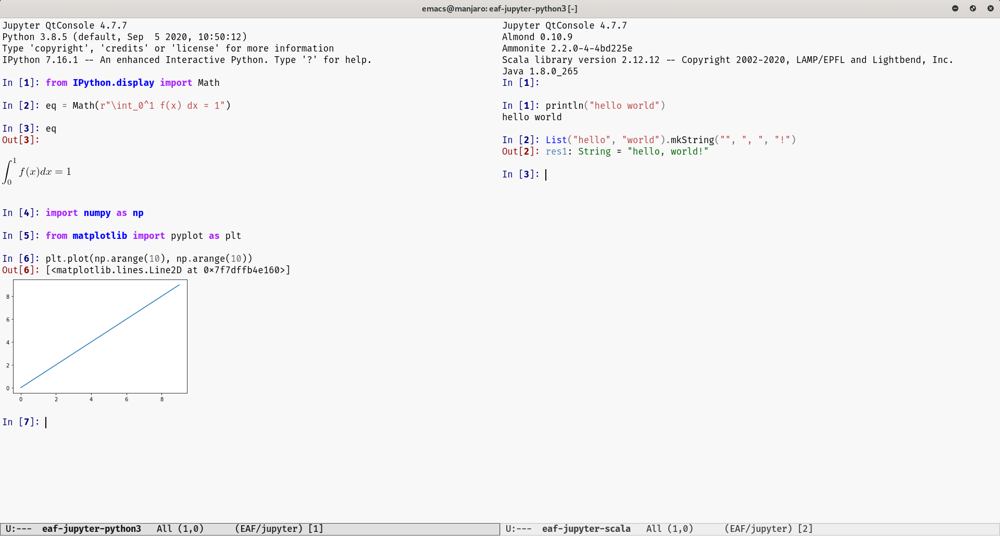

### EAF Jupyter
<p align="center">
  
</p>

Jupyter application for the [Emacs Application Framework](https://github.com/emacs-eaf/emacs-application-framework).

### Load application

[Install EAF](https://github.com/emacs-eaf/emacs-application-framework#install) first, then add below code in your emacs config:

```Elisp
(add-to-list 'load-path "~/.emacs.d/site-lisp/emacs-application-framework/")
(require 'eaf)
(require 'eaf-jupyter)
```

### Dependency List

| Package          | Description               |
| :--------        | :------                   |
| python-qtconsole | Provide RichJupyterWidget |

### The keybinding of EAF Jupyter.

| Key   | Event   |
| :---- | :------ |
| `C-+` | zoom_in |
| `C--` | zoom_out |
| `C-0` | zoom_reset |
| `C-l` | eaf-send-key-sequence |
| `C-a` | eaf-send-key-sequence |
| `C-e` | eaf-send-key-sequence |
| `C-u` | eaf-send-key-sequence |
| `C-k` | eaf-send-key-sequence |
| `C-y` | eaf-send-key-sequence |
| `C-p` | eaf-send-key-sequence |
| `C-n` | eaf-send-key-sequence |
| `C-f` | eaf-send-key-sequence |
| `C-b` | eaf-send-key-sequence |
| `C-d` | eaf-send-key-sequence |
| `M-b` | eaf-send-key-sequence |
| `M-f` | eaf-send-key-sequence |
| `M-d` | eaf-send-key-sequence |
| `M-<` | eaf-send-key-sequence |
| `M->` | eaf-send-key-sequence |
| `<C-return>` | eaf-send-ctrl-return-sequence |
| `<S-return>` | eaf-send-shift-return-sequence |

